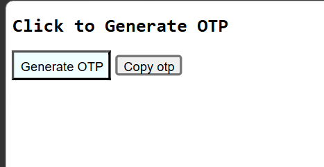
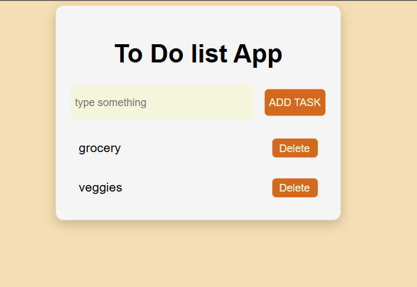
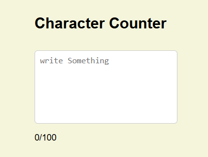
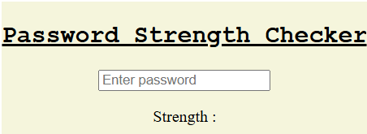

# javascriptvaish

This is my JavaScript practice repo where I build one mini project every day.

---

## Projects

### 1. OTP Generator
A simple OTP generator that creates a random 4-digit code on button click.
- **Concepts:** DOM manipulation, Math.random(), event listeners
- **File:** `otp-generator.html`

---

### 2. To-Do List App
Add tasks, mark them as completed with strikethrough, and delete them.
- **Concepts:** DOM manipulation, createElement, classList.toggle, event listeners
- **File:** `todo-list.html`

---

### 3. Character Counter
A textarea that counts characters in real time with a 100 character limit. The counter turns orange near the limit and red when maxed out.
- **Concepts:** DOM manipulation, event listeners, input event, dynamic styling
- **File:** `character-counter.html`

---

### 4. Password Strength Checker
A password input that checks strength in real time. Shows weak, medium, or strong based on length, numbers, uppercase letters, and special characters.
- **Concepts:** DOM manipulation, regex, event listeners, conditional logic
- **File:** `password-strength.html`

---

### 5. Dark/Light Mode Toggle
A button that switches the page between dark and light mode, updating the heading text accordingly.
- **Concepts:** DOM manipulation, classList.toggle, classList.contains, event listeners
- **File:** `toggle-button.html`

---

### 6. Random Quote Generator
Displays a random motivational quote from a list every time the button is clicked.
- **Concepts:** DOM manipulation, arrays, Math.random(), Math.floor(), event listeners
- **File:** `random-quote-generator.html`

---

### 7. Number Guessing Game
Guess a randomly generated number between 1 and 10. The game tells you if your guess is too high, too low, or correct.
- **Concepts:** DOM manipulation, Math.random(), Math.floor(), Number(), event listeners
- **File:** `number-picker.html`

---

*More projects coming daily!*